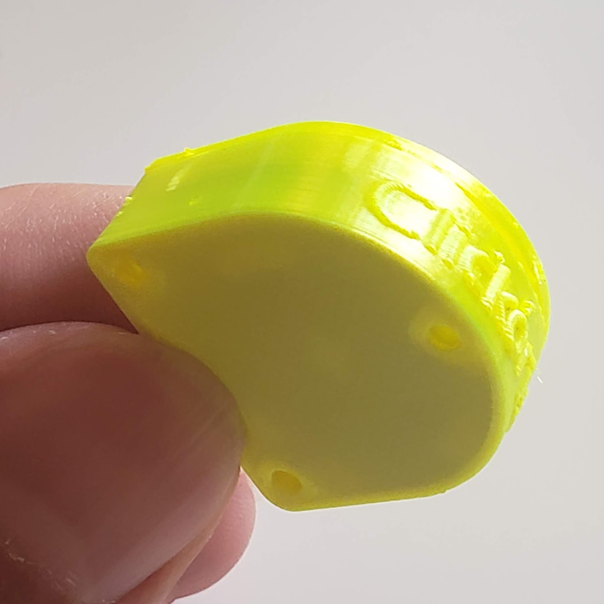
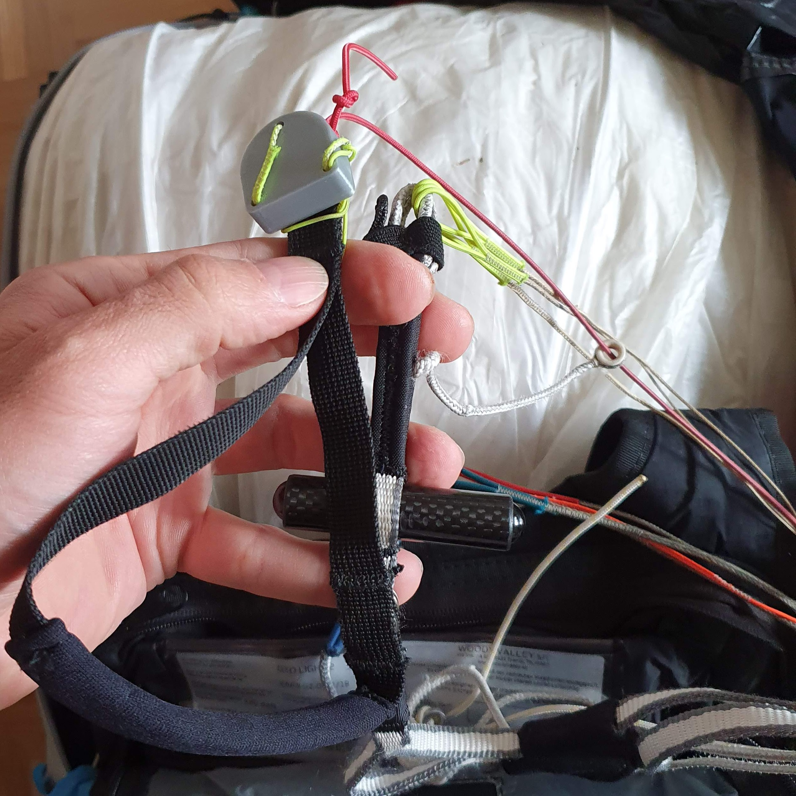
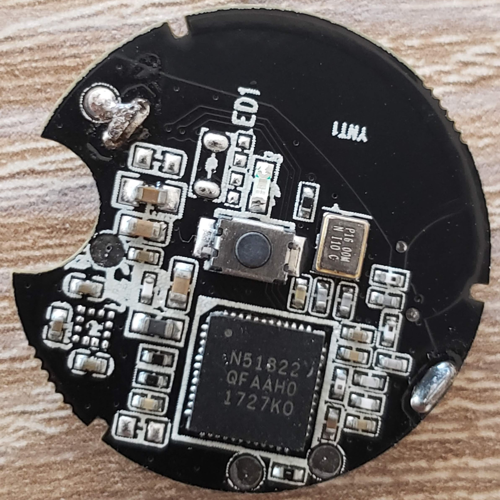
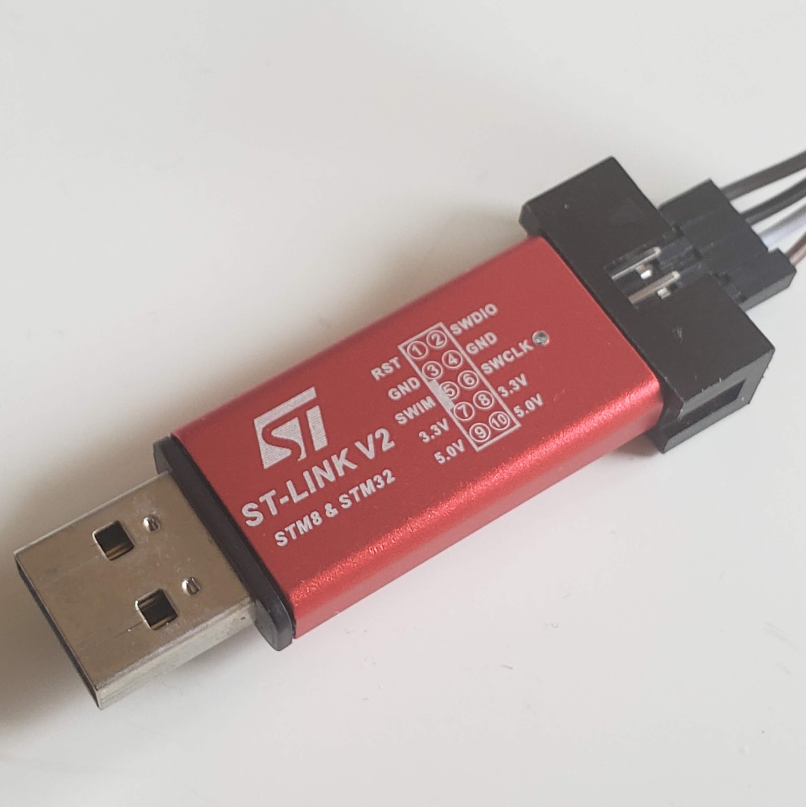
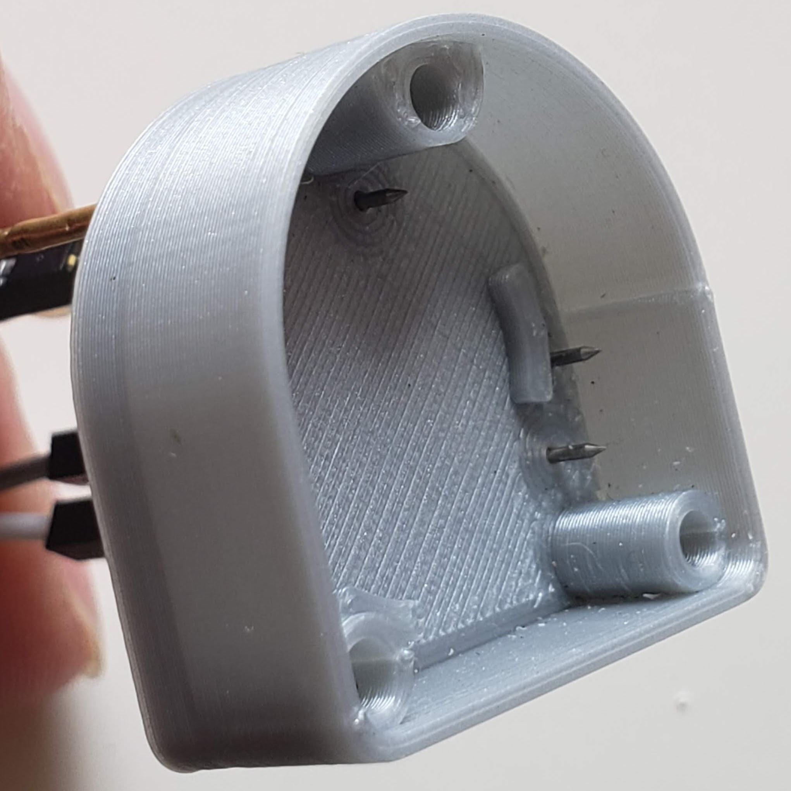
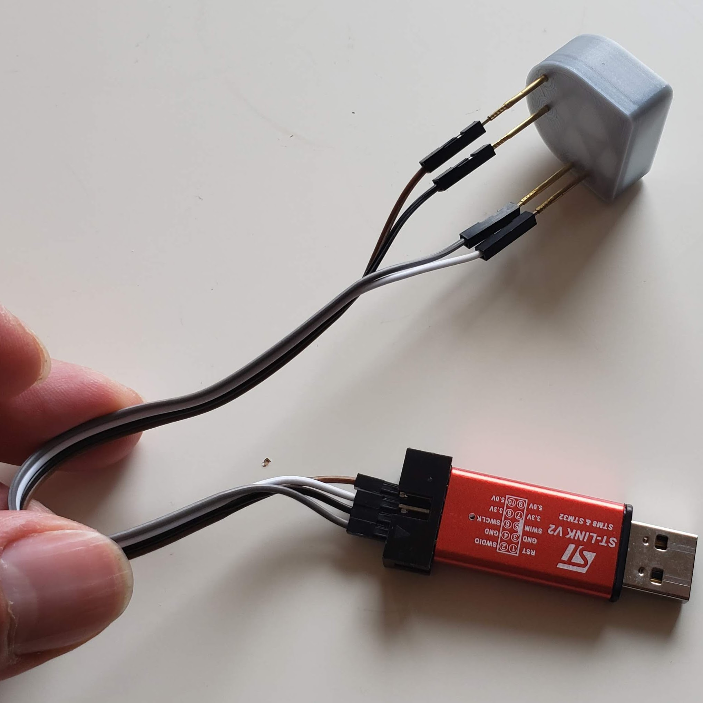
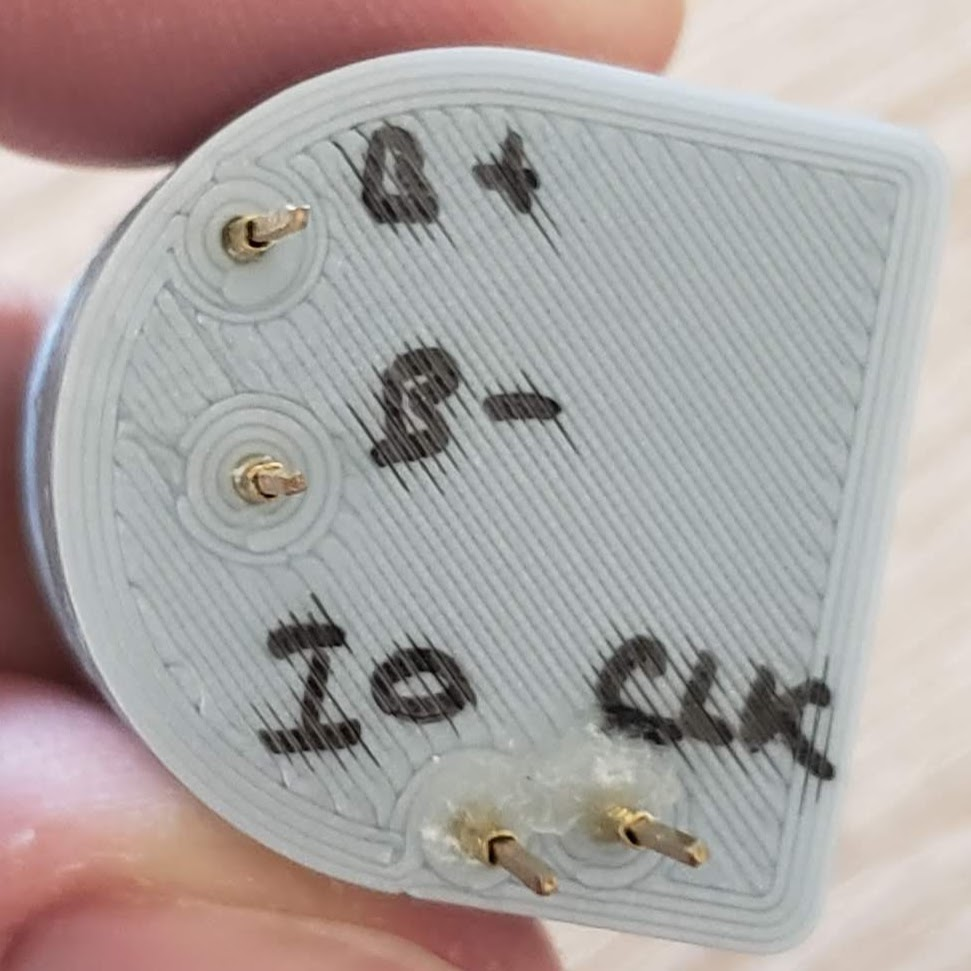

# 100pct-ptt a.k.a. Clickoris
A BLE hardware button for transmitting over the [Zello](http://zello.com) PTT app.

Primarily intended to be used during paragliding flights to communicate without having to take your hands off controls.

## Introduction

Clickoris was created to help communicate with others during cross-country flights.
It improves on handheld UHF radios when flying in an area with good cellular network
coverage (Swiss Alps).

The device is based on an [nrf51822](https://www.nordicsemi.com/products/nrf51822) BLE beacon
([aliexpress](https://www.aliexpress.com/item/32810276263.html)), powered by a CR2032 battery.
It integrates with the Zello App (Android and iPhone).

The provided 3d-printed case can be mounted to a brake toggle, keeping the device within easy reach
and making it possible to push the button even when wearing thick gloves.

Once paired in the Zello app, button stays connected for a several hours and can be used even
with the phone screen turned off (or running another app). When not in use, the button is powered
off until it is clicked again. When powered off, battery usage is close to zero, and the button
should remain usable for a few years.

## Bill of materials

### Clickoris itself

- nrf51822-based board ([ali search](https://www.aliexpress.com/wholesale?SearchText=NRF51822+beacon))

  

- cr2032 battery
- case: base, see `bleButtonCase/baseCase.stl`
- case: cover, see `bleButtonCase/cat.stl`
- string for mounting (paraglider line works well).

### BOM for programming

It is possible to solder the 4 wires to the nrf51822 board. But it gets old quickly when programming
several boards, making it worth building the [programmer case](#programmer).

- STLink V2 programmer ([ali search](https://www.aliexpress.com/wholesale?SearchText=stlink+v2))

  

- 4 wires (ground, +3.3V, clock, data)
- (optional) programmer case 
- (optional) programmer pins (4x, [ali](https://www.aliexpress.com/item/32944964110.html))

## Pairing with Zello
Android [instructions](https://docs.google.com/document/d/1WHSKjbKlpSfUliMCR7onvabltsctEBkE9Yl1S6ZhOwA/edit). IPhone should be similar.

## Programming

The board is programmed with an STLink V2 programmer using 4 pins (SWDIO, SWCLK, GND, 3.3V). It
is possibld to simply solder the 4 wires to the board, or build a [Programmer](#programmer).

Typically programming is done from PlatformIO, however in some cases it did not work and I had to
flash the NRF softdevice from Arduino first, then program it from PlatformIO (see [TODOs](#todos)).

Before programming the button, it is necessary to apply a patch to the BLE stack of the Arduino
framework, otherwise the power usage will be noticeably significantly higher. The patch is located
in `src/lowPow.patch` and more information is available in this [blog post](https://www.iot-experiments.com/nrf51822-and-ble400/)

### Programmer
To make programming many buttons easier it was worth building a special case for it: 

Spring loaded pins can be glued to the case so that the button can be pushed in when it is being
programmed.

The case is then connected to an STLink V2 using the following pinout ("B" stands for battery):

## TODOs

- Report battery level to the phone.

The code is already there, but the service is not exported as I haven't tested it with an iphone yet.

- Figure out why sometimes it is necessary to flash the NRF softdevice via [the arduino programmer](https://github.com/sandeepmistry/arduino-nRF5)

In some cases flashing using Platform IO does not work (only happened on some boards), but it started to work
after I flashed the softdevice from the Arduino IDE.
