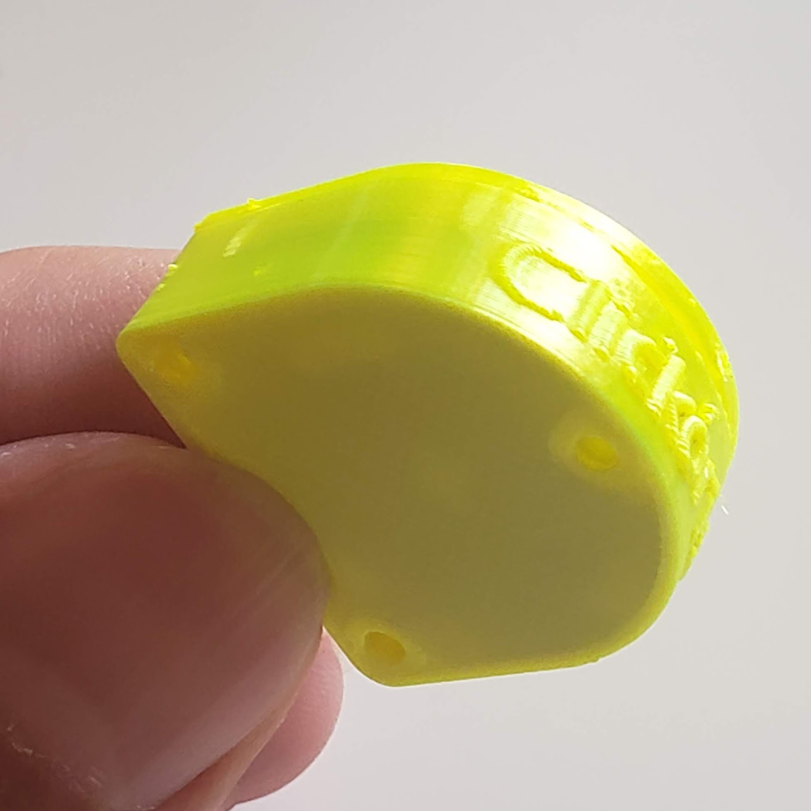
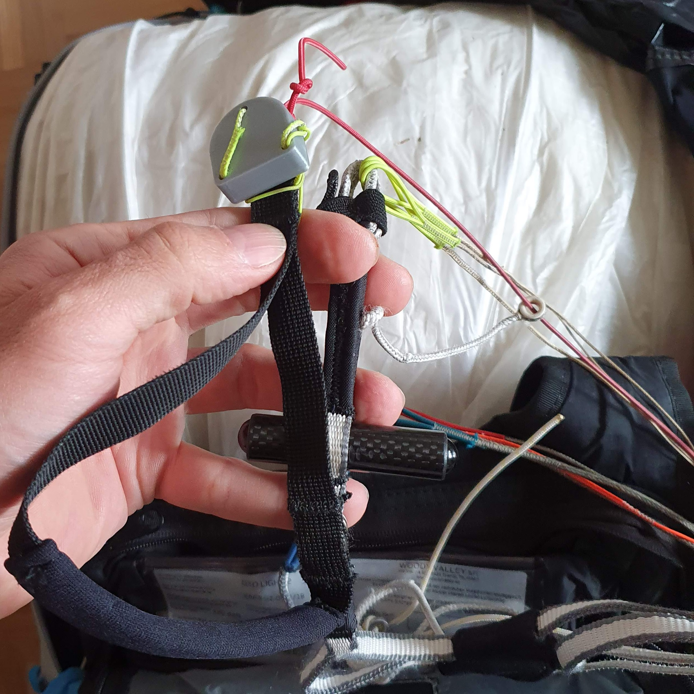
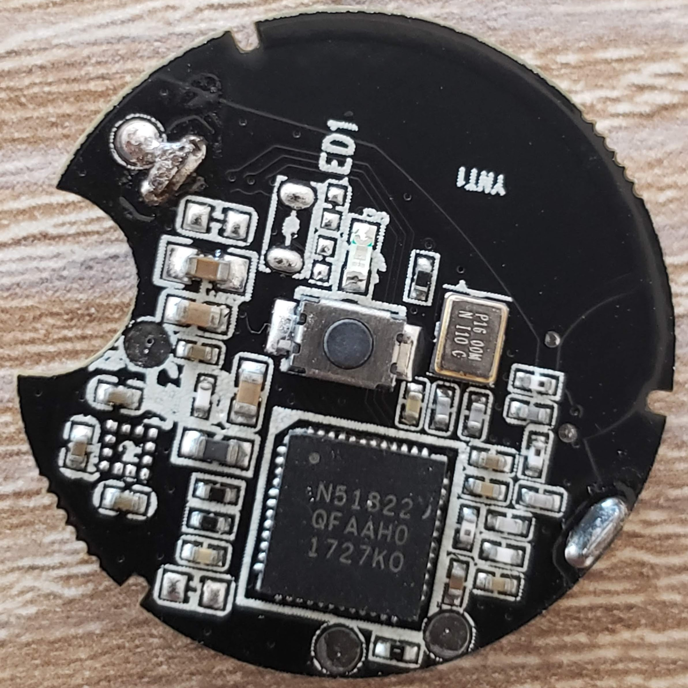
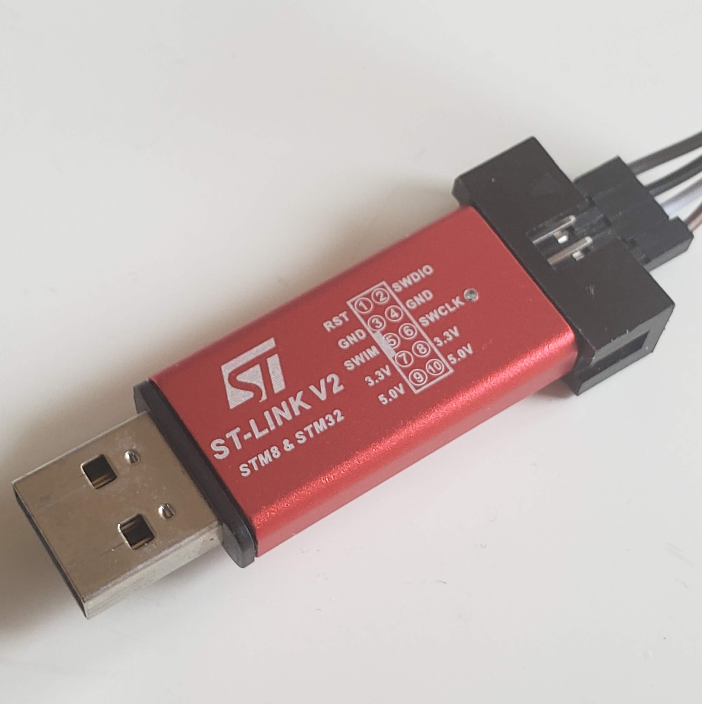
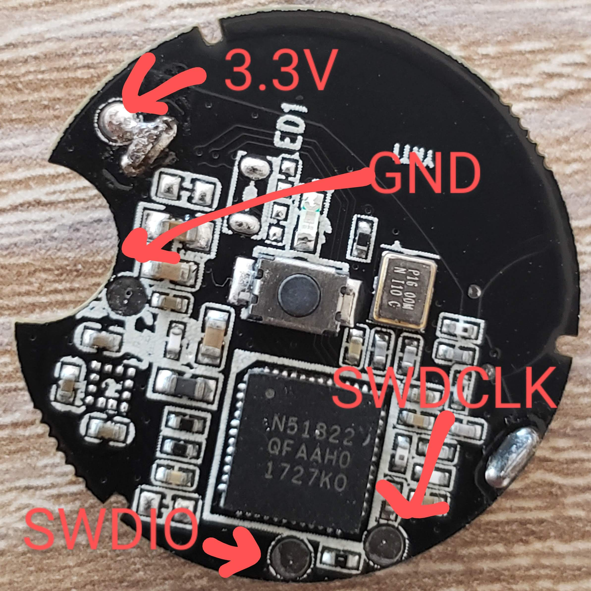
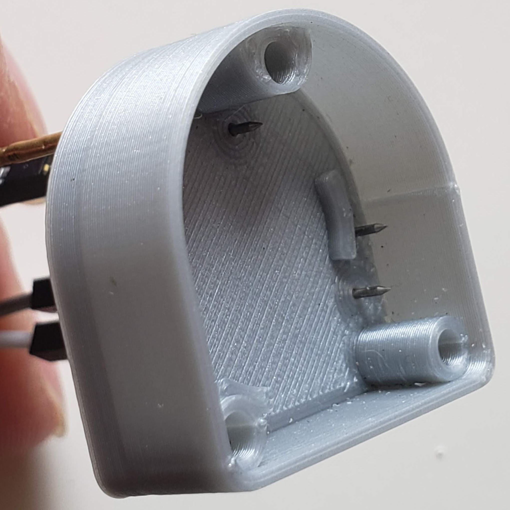
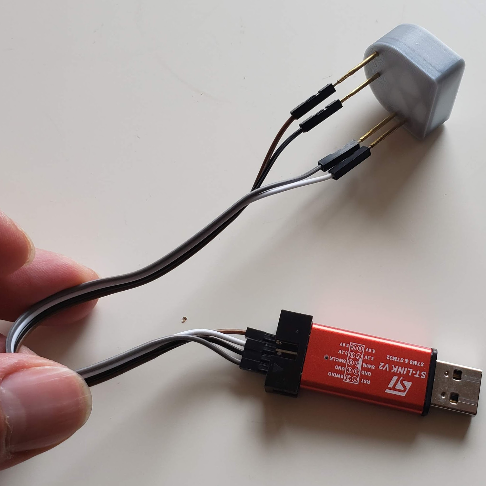
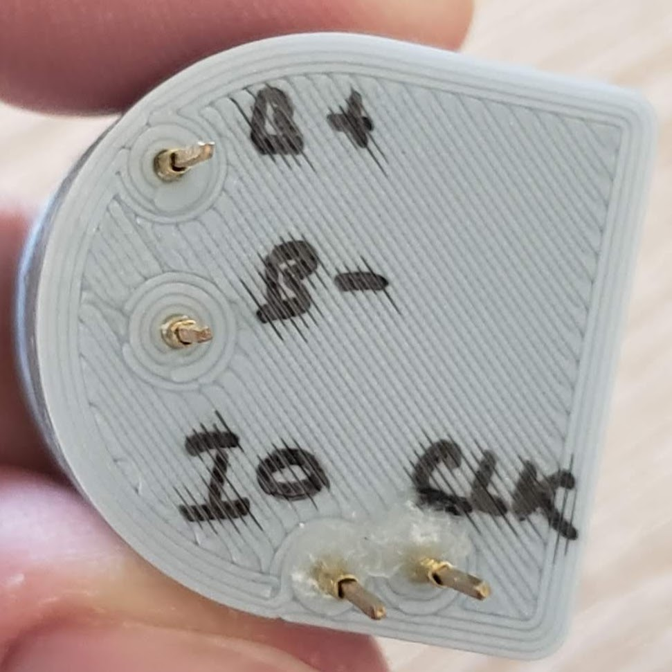

# 100pct-ptt a.k.a. Clickoris

A BLE hardware button for transmitting over the [Zello](http://zello.com) push-to-talk app while flying a
paraglider.

## Introduction

Clickoris was created to help communicating with others during cross-country flights.
It improves on handheld UHF radios when flying in an area with good cellular network
coverage (Swiss Alps).

The device is based on an [nrf51822](https://www.nordicsemi.com/products/nrf51822) BLE beacon
([aliexpress](https://www.aliexpress.com/item/32810276263.html)), powered by a CR2032 battery.
It integrates with the Zello App (Android and iPhone).

The provided 3D-printed case is designed to be mounted to a brake toggle, keeping the device within easy reach
and making it possible to push the button even when wearing thick gloves.

Once paired in the Zello app, button stays connected for several hours and can be used even
with the phone screen turned off or when running another app. When not in use, the button is powered
off (a click powers it on). When powered off, battery usage is close to zero, and the button
should remain usable for several years.

## How to make one

1. Get the parts (use the provided links to AliExpress)

    - [board](https://www.aliexpress.com/wholesale?SearchText=NRF51822+beacon)
	  

    - [programmer](https://www.aliexpress.com/wholesale?SearchText=stlink+v2)
	   

    - CR2032 battery

1. [Program](#programming-the-board) the board.

1. Print the case, it consists of 2 parts:
    - base `bleButtonCase/baseCase.stl`
    - cover `bleButtonCase/cap.stl`

1. [Pair](#pairing-with-zello) with Zello.

1. Tie it to a brake handle.

1. Go fly.

## Programming the board

The board is programmed with an STLink V2 programmer using 4 pins (SWDIO, SWCLK, GND, 3.3V). It
is possible to simply solder the 4 wires to the board (pinout below), or build a [flashing case](#flashing-case).

### Pinout diagram 

### Flashing

Flashing is done from the [PlatformIO VSCode plugin](https://platformio.org/). Install it first and open this repository in PlatformIO.

Before programming the button, it is necessary to apply a patch to the BLE stack of the Arduino
framework, otherwise the power usage will be significantly higher. The patch is located
in `src/lowPow.patch` and more information is available in this [blog post](https://www.iot-experiments.com/nrf51822-and-ble400/)

Once the patch is applied, it should be just the matter of uploading the firmware.

To check if the Clickoris is working, install the battery and push the button. It should make the green light blink once quickly.
If the light stays off, read on.

**NOTE** in in some cases the button did not work after flashing from PlatformIO. In those cases it
helped to:
1. [Flash the NRF softdevice](https://github.com/sandeepmistry/arduino-nRF5#flashing-a-softdevice) from the Arduino IDE.
1. Program it from PlatformIO as normal(see [TODOs](#todos)).

### Flashing case

To make programming many buttons easier it is worth building a special case to avoid having to solder the programming wires.

Four spring-loaded pins are glued to the 3D-printed case so that the board can be pushed in with a finger against the contacts
while it is being flashed.

The pins are connected to an STLink V2 using the following pinout ("B" stands for battery):

## Printing

Printed with no supports, 15% infill works OK. Use 0.2mm layer height as this is what I've tested with. Both parts of the case
can be printed in one go.

## Pairing with Zello

Android [instructions](https://docs.google.com/document/d/1WHSKjbKlpSfUliMCR7onvabltsctEBkE9Yl1S6ZhOwA/edit). Pairing with an iPhone should be similar.

## Code dependencies

1. VSCode + PlatformIO with the arduino framework and the NRF S130 softdevice.

1. [BLEPeripheral](https://github.com/sandeepmistry/arduino-BLEPeripheral).
This library is forked here, as a few low-level modifications were needed to get it working with an iPhone. 

## TODOs

- Report battery level to the phone.

The code is already there, but the service is not exported as I haven't tested it with an iphone yet.

- Figure out why sometimes it is necessary to flash the NRF softdevice via [the arduino programmer](https://github.com/sandeepmistry/arduino-nRF5)

In some cases flashing using Platform IO does not work (only happened on some boards), but it started to work
after I flashed the softdevice from the Arduino IDE.
